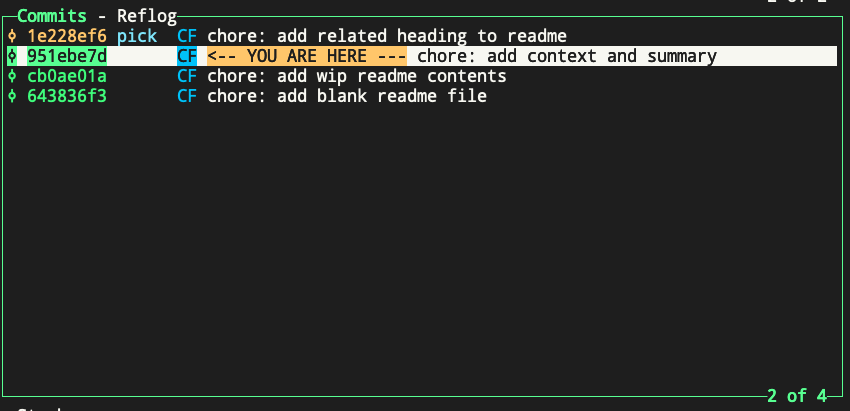
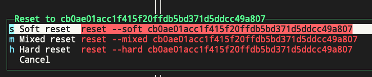
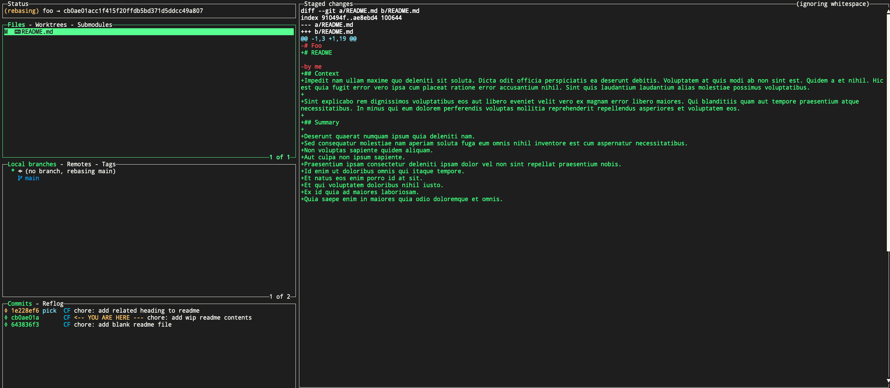
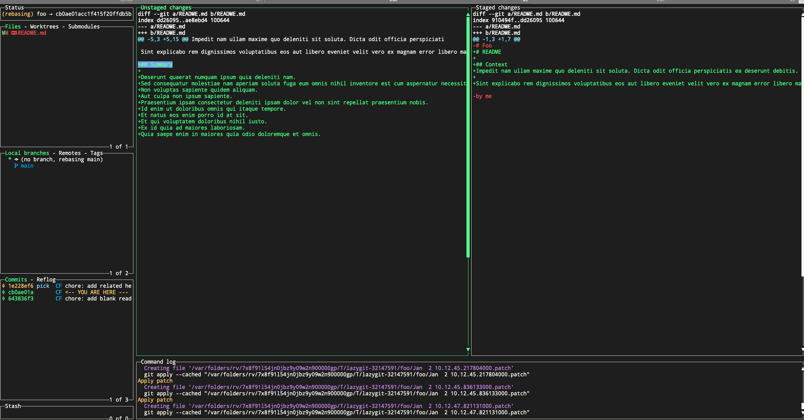
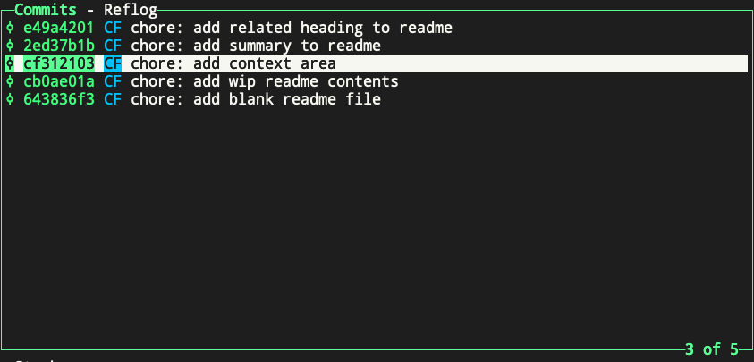

# Split up a previous commit
If you have a previous commit you want to split up into multiple commits, you can do this in `lazygit` by doing this:

Find the commit you want to split up and press "e" to start interactive rebase. You'll see that all following commits are labeled with "pick":

Highlight the parent commit of the commit you want to split up. In this case, highlight cb0ae01a, which is the parent commit of 951ebe7d, and press "g", and select "s" for "soft reset".

In the above screenshot, you can see your changes are now unstaged, and ready to be committed again. Since we wanted to split up these changes into 2+ commits, we can do that now. The first thing you'll probably want to do is remove all changes from the git index, and you can do that by selecting the files in the Files area, and press "space" to unstage all changes in that file.

Now, with that file still selected, press "enter" to start staging individual lines you want to commit in your first commit. In our case, we only want to commit the "Context" heading and paragraphs, and leave out the "Summary" heading and paragraphs. So we will select only the lines related to the change we want to make for the first commit.

You can now commit just those changes by pressing "c" in the Files area of `lazygit`.

You'll still be in interactive rebase, and and make more custom patches/changes and commit each one as you want.
When you're done, press "m" to view "merge/rebase options" and continue the rebase to move on. Eventually it will get you back to this view:

As you can see, we now have two commits where a single commit used to be.

