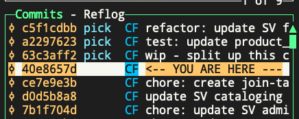
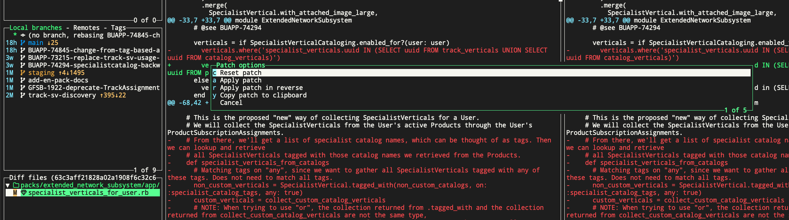
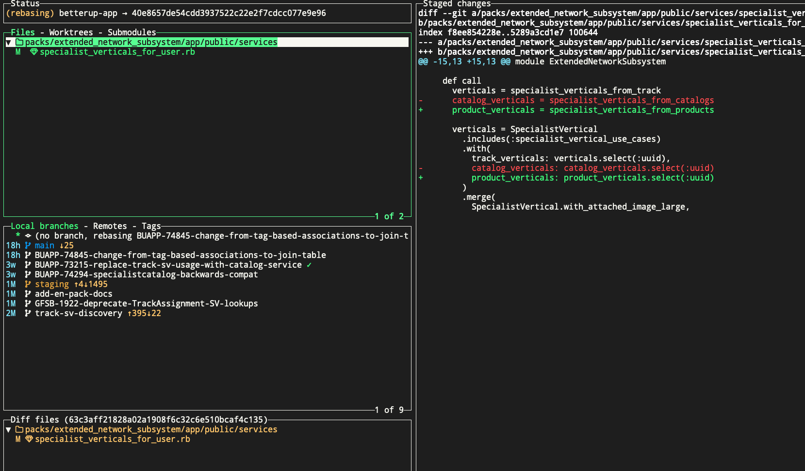
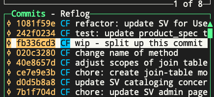

# Split up a previous commit
If you have a previous commit you want to split up into multiple commits, you can do this in `lazygit` by doing this:

For the commit you want to split up, go to the parent commit, and press "e" to start interactive rebase
You'll see that all following commits are labeled with "pick"

Highlight the commit you want to edit/split (63c3aff2 in the screenshot), and press 'e' to mark it as an 'edit' commit, not a 'pick' commit.

Then press "enter" on that commit to see the changes made in that commit.
Select the file you want to make changes to, and select individual lines to change, or press "space" to make changes on the entire file.
Press `<Control-P>` to see the custom patch options.
- To remove the selected file (or patches) from the commit, select "c Reset patch" to undo those changes

- You can also select just a few lines, and apply just those lines as a patch by selecting "a Apply patch"

This is what you'll see if you selected just a few lines:

You can now commit just those changes by pressing "C" in the Files area of `lazygit`
You'll still be in interactive rebase, and and make more custom patches/changes and commit each one as you want.
When you're done, press "m" to view "merge/rebase options" and continue the rebase to move on. Eventually it will get you back to this view:

The new commit is there now, "change name of method", and it was applied before our target commit, "wip - split up this commit".
Neat!

