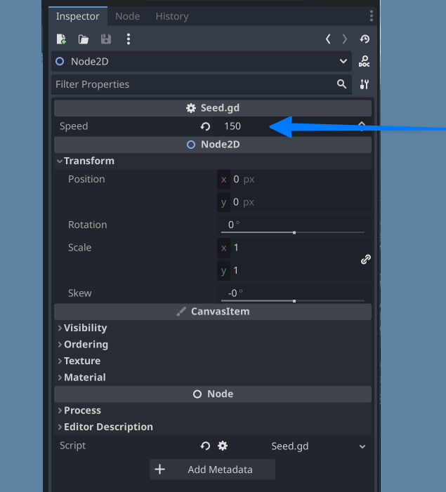

# GDScript Reference

See [GDScript Reference](https://docs.godotengine.org/en/stable/tutorials/scripting/gdscript/gdscript_basics.html)

```gdscript
# Everything after "#" is a comment.
# A file is a class!

# (optional) icon to show in the editor dialogs:
@icon("res://path/to/optional/icon.svg")

# (optional) class definition:
class_name MyClass

# Inheritance:
extends BaseClass


# Member variables.
var a = 5
var s = "Hello"
var arr = [1, 2, 3]
var dict = {"key": "value", 2: 3}
var other_dict = {key = "value", other_key = 2}
var typed_var: int
var inferred_type := "String"

# Constants.
const ANSWER = 42
const THE_NAME = "Charly"

# Enums.
enum {UNIT_NEUTRAL, UNIT_ENEMY, UNIT_ALLY}
enum Named {THING_1, THING_2, ANOTHER_THING = -1}

# Built-in vector types.
var v2 = Vector2(1, 2)
var v3 = Vector3(1, 2, 3)


# Functions.
func some_function(param1, param2, param3):
	const local_const = 5

	if param1 < local_const:
		print(param1)
	elif param2 > 5:
		print(param2)
	else:
		print("Fail!")

	for i in range(20):
		print(i)

	while param2 != 0:
		param2 -= 1

	match param3:
		3:
			print("param3 is 3!")
		_:
			print("param3 is not 3!")

	var local_var = param1 + 3
	return local_var


# Functions override functions with the same name on the base/super class.
# If you still want to call them, use "super":
func something(p1, p2):
	super(p1, p2)


# It's also possible to call another function in the super class:
func other_something(p1, p2):
	super.something(p1, p2)


# Inner class
class Something:
	var a = 10


# Constructor
func _init():
	print("Constructed!")
	var lv = Something.new()
	print(lv.a)
```

## export
If you want a script variable to be controlled by the Godot editor, you can use the `export` keyword.

```gdscript
@export var SPEED = 1
```



## if/elif/else

```gdscript
if condition:
  pass
elif other_condition:
  pass
else:
  pass
```

```gdscript
# Check if a letter is in a string.
var text = "abc"
if 'b' in text: print("The string contains b")

# Check if a variable is contained within a node.
if "varName" in get_parent(): print("varName is defined in parent!")
```

## while / for loops

```gdscript
while (expression):
	statement(s)
```

```gdscript
for x in [5, 7, 11]:
	statement # Loop iterates 3 times with 'x' as 5, then 7 and finally 11.

var dict = {"a": 0, "b": 1, "c": 2}
for i in dict:
	print(dict[i]) # Prints 0, then 1, then 2.

for i in range(3):
	statement # Similar to [0, 1, 2] but does not allocate an array.

for i in range(1, 3):
	statement # Similar to [1, 2] but does not allocate an array.

for i in range(2, 8, 2):
	statement # Similar to [2, 4, 6] but does not allocate an array.

for i in range(8, 2, -2):
	statement # Similar to [8, 6, 4] but does not allocate an array.

for c in "Hello":
	print(c) # Iterate through all characters in a String, print every letter on new line.

for i in 3:
	statement # Similar to range(3).

for i in 2.2:
	statement # Similar to range(ceil(2.2)).

# If you want to assign values on an array as it is being iterated through, it is best to use for i in array.size().
for i in array.size():
		array[i] = "Hello World"  
```

## match

A `match` statement is used to branch execution of a program. It's the equivalent of the switch statement found in many other languages, but offers some additional features.


```gdscript
match <expression>:
	<pattern(s)>:
		<block>
	<pattern(s)> when <guard expression>:
		<block>
	<...>
```
