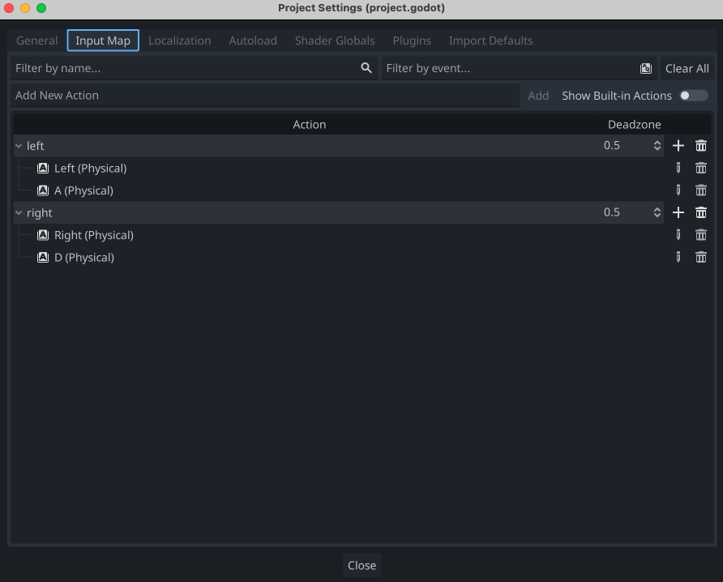

# Keyboard Inputs

First, you must setup your Godot Project's input maps. Go to `Project > Project Settings > Input Map` and do something like the following:




Then you can add a script to your player node and use the following code to move the player left and right.

```gdscript
extends Node2D

@export var SPEED = 1

var h_velocity = 0
var rotation_amount = 0

# Called when the node enters the scene tree for the first time.
func _ready():
	pass # Replace with function body.

func move(direction, delta):
	if(direction == 1):
		h_velocity = SPEED
		rotation_amount = 30
	elif(direction == -1):
		h_velocity = -SPEED
		rotation_amount = -30
	else:
		rotation_amount = 0
		h_velocity = 0

	$Seed.rotation_degrees = rotation_amount
	position.x += h_velocity * delta

# Called every frame. 'delta' is the elapsed time since the previous frame.
func _process(delta):
	if Input.is_action_pressed("left"):
		move(-1, delta)
	elif Input.is_action_pressed("right"):
		move(1, delta)
	else:
		move(0, delta)
```
