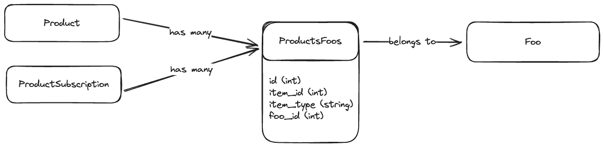

# Creating a polymorphic join table

Found this via example here: https://stackoverflow.com/a/51564821/38375

Needed it to setup polymorphic join table for Product and ProductSubscription the join to the "Foo" table.



To set this up in Rails, I needed to do this:

```ruby
class ProductsFoos < ApplicationRecord
  belongs_to :item, polymorphic: true
  belongs_to :foo
end

class Foo < ApplicationRecord
  has_many :products_foos, class_name: 'ProductsFoos', dependent: :destroy
  has_many :products, through: :products_foos
  has_many :product_subscriptions, through: :products_foos
end

class Product < ApplicationRecord
  has_many :products_foos, class_name: 'ProductsFoos', dependent: :destroy, as: :item
  has_many :foos, through: :products_foos
end

class ProductSubscription < ApplicationRecord
  has_many :products_foos, class_name: 'ProductsFoos', dependent: :destroy, as: :item
  has_many :foos, through: :products_foos
end
```

It was important to set `belongs_to :item, polymorphic: true` in the join-table class
Then setup the `has_many :products_foos` and add `as: :item`

That then allows me to do this:

```ruby
product = Product.last
product.foos << Foo.first
```

That creates a new join-table record, and sets `item_id` to `product.id` and `item_type` to `"Product"`
