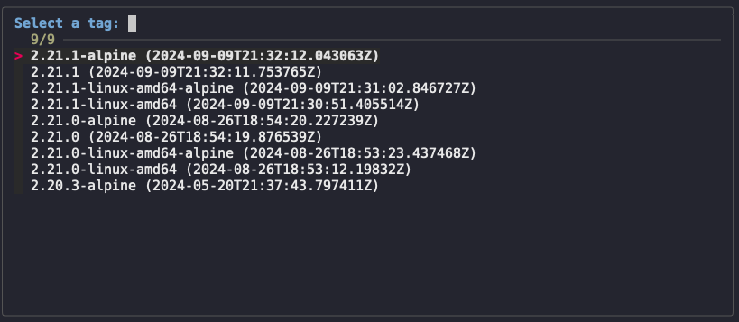

# Fzf

[junegunn/fzf](https://github.com/junegunn/fzf)

NOTE: For examples on this page, I assume that the input text is stored in a variable called `$input`. You can replace `$input` with the actual input text.

## Multi-select
If you want to select multiple items, you can use the `--multi` option

Input:
```
foo
bar
baz
```
To open an `fzf` window that allows you to select multiple items, you can do this, and press `TAB` to select multiple items, then `ENTER` to confirm your selection:

```
echo "$input" | fzf --multi
```

## Output a particular field with `--bind`

Given the following input text of tags and some dates, you can use the `--bind` option to specify what part of the selected text to output when you press `ENTER`:

Input:
```
2.21.1-alpine (2024-09-09T21:32:12.043063Z)
2.21.1 (2024-09-09T21:32:11.753765Z)
2.21.1-linux-amd64-alpine (2024-09-09T21:31:02.846727Z)
2.21.1-linux-amd64 (2024-09-09T21:30:51.405514Z)
2.21.0-alpine (2024-08-26T18:54:20.227239Z)
2.21.0 (2024-08-26T18:54:19.876539Z)
2.21.0-linux-amd64-alpine (2024-08-26T18:53:23.437468Z)
2.21.0-linux-amd64 (2024-08-26T18:53:12.19832Z)
2.20.3-alpine (2024-05-20T21:37:43.797411Z)
```

You can use the `fzf --bind` option to set a keybinding to perform an action. For our purposes, we want to use the `ENTER` key, which is the default selection key.

```sh
echo "$input" | fzf --bind "enter:become(echo {1})"
2.21.2
```

## Resize the window (and other decorations)
`fzf` by default takes up the entire screen, but you can resize it by using the `--height` option:

Input:
```
2.21.1-alpine (2024-09-09T21:32:12.043063Z)
2.21.1 (2024-09-09T21:32:11.753765Z)
2.21.1-linux-amd64-alpine (2024-09-09T21:31:02.846727Z)
2.21.1-linux-amd64 (2024-09-09T21:30:51.405514Z)
2.21.0-alpine (2024-08-26T18:54:20.227239Z)
2.21.0 (2024-08-26T18:54:19.876539Z)
2.21.0-linux-amd64-alpine (2024-08-26T18:53:23.437468Z)
2.21.0-linux-amd64 (2024-08-26T18:53:12.19832Z)
2.20.3-alpine (2024-05-20T21:37:43.797411Z)
```

```sh
echo "$input" | fzf --height 20 --reverse --border --prompt "Select a tag: "
```



